# autoEcho: AI-Powered Echocardiography Analysis Platform

**autoEcho** is an advanced clinical workstation software designed for automated cardiac function assessment from 2D echocardiography cine loops. Built with a high-performance C++/Qt/QML front-end and a deep learning backend, it streamlines echocardiographic workflows by providing automated view classification, myocardial border delineation, speckle tracking deformation analysis, volumetric assessment, and structured clinical reporting.

---

## 1. System Architecture & End-to-End Pipeline

The clinical pipeline follows a structured, two-phase modular workflow that balances full automation with mandatory clinician verification at critical decision points:

*   **Phase 1: Acquisition & Anatomical Delineation**
    *   **DICOM Ingestion:** Multi-series PACS integration, metadata extraction, and local directory indexing.
    *   **AI View Detection:** Deep convolutional neural network for acoustic view classification (A4C, A2C, A3C, short-axis views) and ECG-synchronized R-wave cardiac cycle gating.
    *   **AI Myocardial Segmentation:** Automated multi-point tracking of endocardial and epicardial borders with automatic identification of End-Diastole (ED) and End-Systole (ES) frames.
    *   **Clinician Review & Interactive Approval:** Manual contour adjustment mode ensuring clinical oversight before deformation computation.
*   **Phase 2: Mechanics Quantification & Clinical Reporting**
    *   **AI Speckle Tracking:** Dense optical flow and feature-tracking algorithms to quantify myocardial tissue deformation frame-by-frame.
    *   **Automated Strain Quantification:** Segmental time-strain curves, Global Longitudinal Strain (GLS), and anatomical curved M-mode colormaps.
    *   **Volumetric Assessment:** Automated Biplane Simpson’s disc summation for LV volumes (EDV, ESV, SV) and Ejection Fraction (LVEF).
    *   **Clinical Reporting & Polar Maps:** AHA 17-segment polar bullseye maps (peak strain and time-to-peak dyssynchrony) alongside structured PACS/PDF reporting.
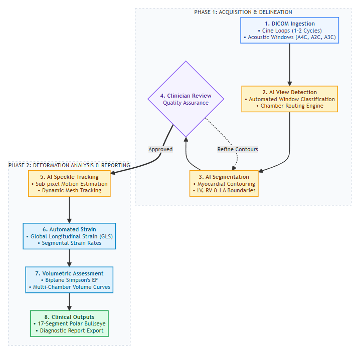

---

## 2. Pipeline Walkthrough & Software Interface

### Step 1: Application Boot & Environment Initialization
The application initializes local runtime environments, CUDA acceleration contexts, and model weights via a modern dark-gold clinical UI.

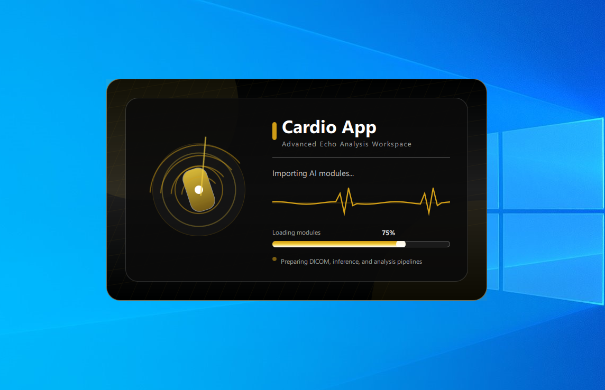
*Figure 1: Cardio App initialization screen displaying runtime environment loading.*

---

### Step 2: Clinical Study Management & DICOM Ingestion
*   High-throughput local directory parsing and `DICOMDIR` support.
*   Structured study list displaying Patient ID, Patient Name, Study Date/Time, Modality (`US`), and Series Object Types.
*   Real-time search filtering by patient demographic and date range.

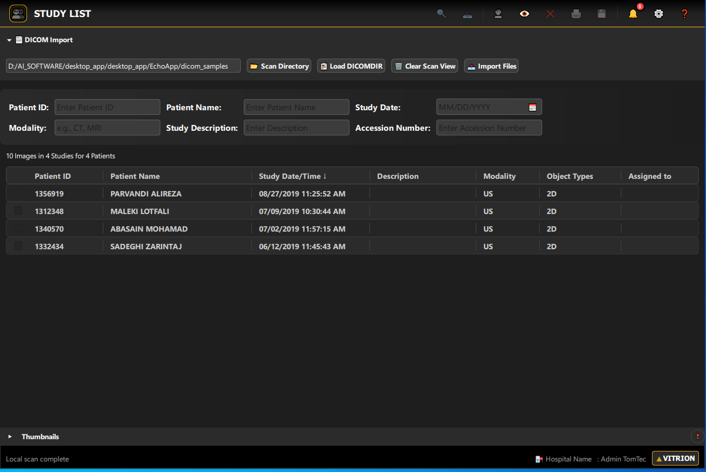
*Figure 2: Clinical study browser with multi-patient filtering and DICOM inspection.*

---

### Step 3: Synchronized Multi-Viewport Viewer & Chamber Selection
*   Simultaneous playback of synchronized apical cine loops (A4C, A2C, A3C).
*   Interactive controls: frame scrubbing, variable speed playback ($0.25\times$ to $2.0\times$), brightness, and contrast optimization.
*   Targeted chamber selection modal: **Left Ventricle (LV)**, **Right Ventricle (RV)**, and **Left Atrium (LA)** analysis modules.

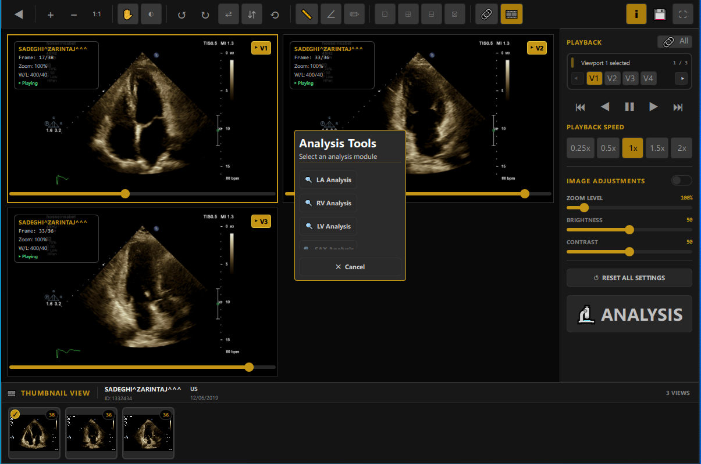
*Figure 3: Synchronized tri-view cine workstation with targeted cardiac chamber selection.*

---

### Step 4: AI View Classification & Frame Navigation
*   Automated acoustic window classification with confidence scoring (e.g., A4C detection at 99% confidence).
*   ECG trace synchronization for automated R-wave detection and cardiac cycle gating.
*   Bottom thumbnail strip navigation enabling frame-accurate scrubbing across the cardiac cycle.

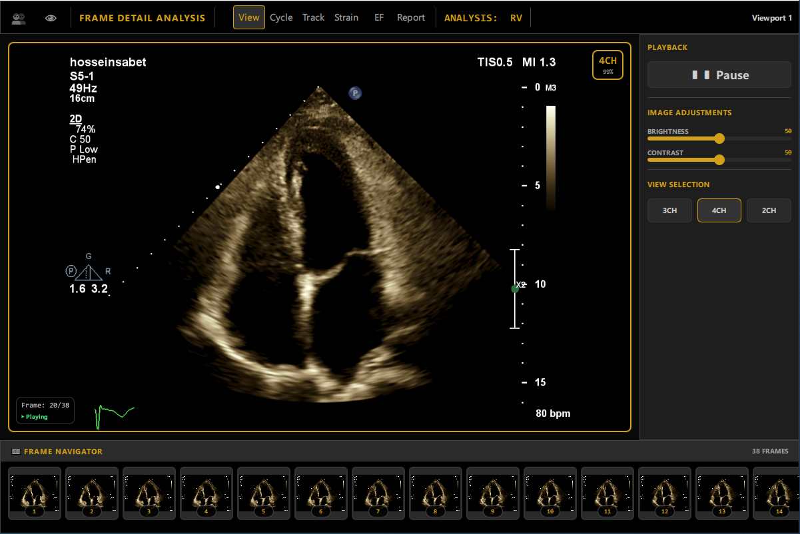
*Figure 4: Automated view classification badge (4CH, 99%) with ECG-synchronized frame navigator.*

---

### Step 5: Myocardial Boundary Segmentation & Landmark Tracking
*   Automated multi-point delineation of endocardial and epicardial borders across standard anatomical walls (septal and lateral segments).
*   Automated identification of End-Diastole (ED Frame) and End-Systole (ES Frame).
*   Interactive **Edit Mode** allowing clinicians to fine-tune control points prior to speckle tracking.

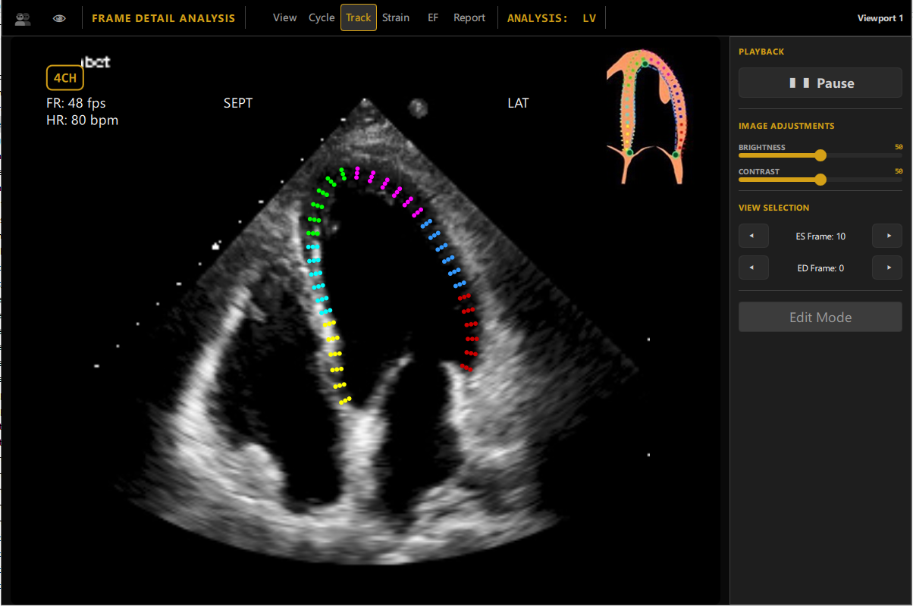
*Figure 5: Myocardial contouring across myocardial walls with automated ED/ES frame identification.*

---

### Step 6: Speckle Tracking & Strain Quantification
*   Sub-pixel speckle tracking quantifying myocardial deformation throughout the cardiac cycle.
*   Automated extraction of peak systolic strain values across basal, mid, and apical segments.
*   Synchronized segmental strain-time curves referenced against Aortic Valve Closure (AVC).
*   Dynamic spatiotemporal strain colormap (curved M-mode) with click-to-approve segment verification.

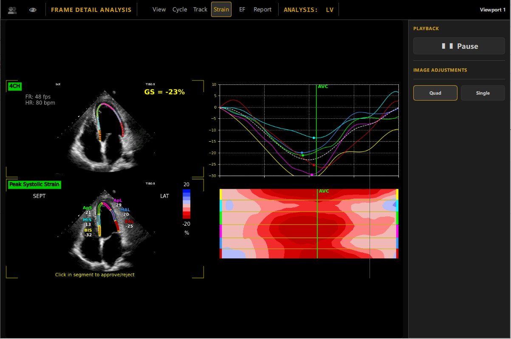
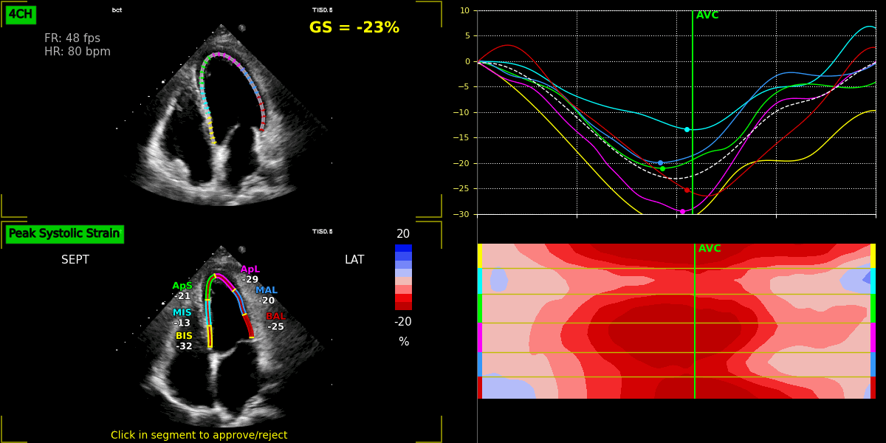
*Figure 6: Longitudinal strain analysis showing segmental waveforms, global strain calculation ($GS = -23\%$), and curved M-mode heatmap.*

---

### Step 7: Volumetric Assessment & Biplane Ejection Fraction (EF)
*   Automated contour extraction at end-diastole and end-systole.
*   Application of modified Simpson's rule (method of discs) for geometric volume reconstruction.
*   Automated hemodynamic quantification:
    *   **LVVED:** Left Ventricular End-Diastolic Volume ($97\text{ ml}$)
    *   **LVVES:** Left Ventricular End-Systolic Volume ($41\text{ ml}$)
    *   **LVSV:** Stroke Volume ($56\text{ ml}$)
    *   **LVEF:** Ejection Fraction ($58\%$)
    *   **LVCO:** Cardiac Output ($4.0\text{ l/min}$)

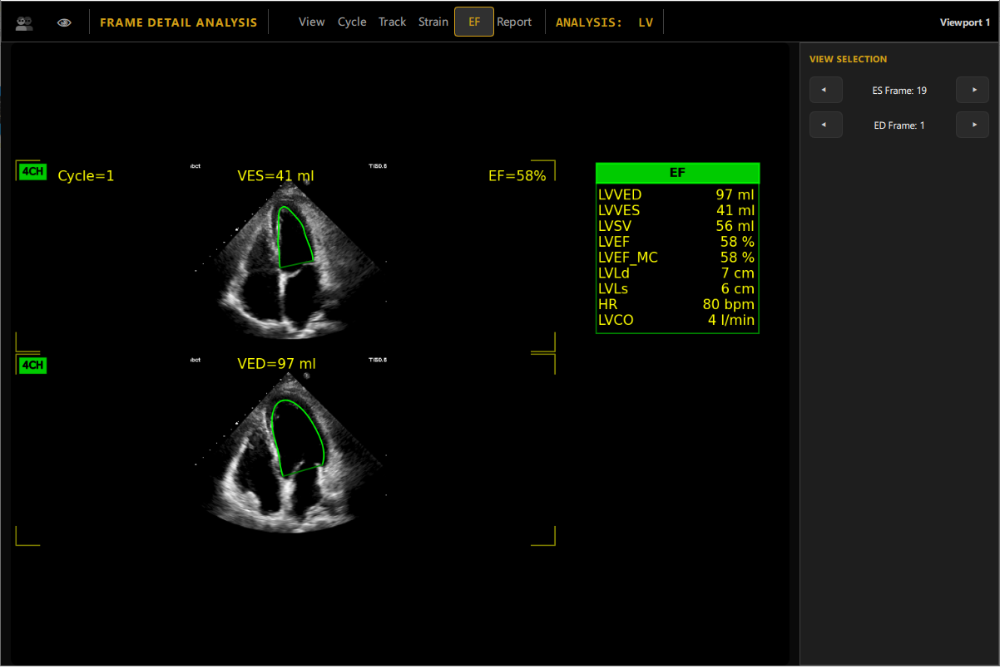
*Figure 7: Automated volumetric assessment showing EDV/ESV cavity segmentation and Simpson's EF quantification.*

---

### Step 8: Multi-Plane Deformation & 17-Segment Polar Bullseye Maps
*   Tri-plane integration compiling segmental longitudinal strain across 4CH, 2CH, and 3CH views.
*   Projection of regional cardiac mechanics onto standard AHA 17-segment polar bullseye plots:
    *   **Peak Systolic Longitudinal Strain Bullseye:** Identifies regional wall motion abnormalities and ischemic territories.
    *   **Time-to-Peak (TTP) Dyssynchrony Bullseye:** Maps mechanical contraction delays and computes Phase Standard Deviation ($PSD$ in ms) for cardiac resynchronization assessment.

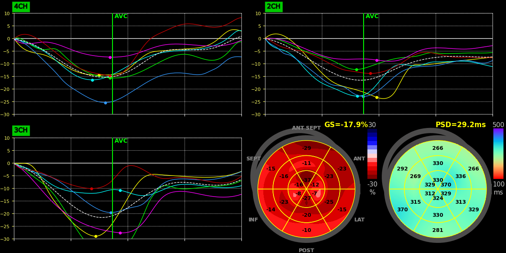
*Figure 8: Synchronized tri-plane strain waveforms (4CH, 2CH, 3CH) and standard 17-segment polar bullseye maps.*

---

### Step 9: Structured Clinical Reporting & PACS Export
*   Consolidation of patient demographics, study identifiers, and biophysical metrics (Heart Rate, Blood Pressure).
*   Multi-view validation checklist confirming completed processing across all acoustic windows ($2\text{CH}$, $3\text{CH}$, $4\text{CH}$).
*   Embedded side-by-side polar maps (Peak Strain and Mechanical Activation Delay).
*   Interactive *Physician Impression* editor for clinical commentary, with one-click export to PACS and PDF formats.

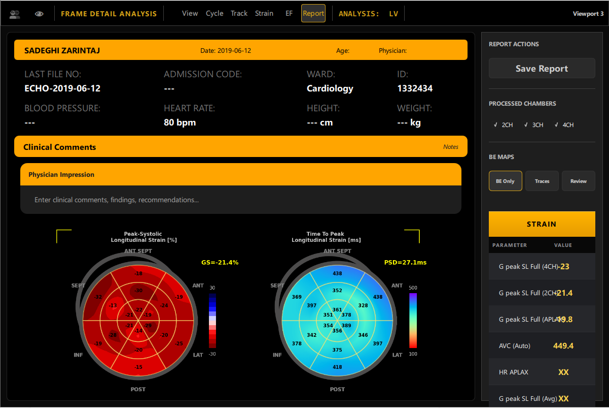
*Figure 9: Comprehensive clinical report dashboard with automated metrics table, polar plots, and impression editor.*

---

## 3. Technology Stack & Key Highlights

*   **User Interface:** C++ / Qt / QML (custom dark clinical aesthetic, GPU-accelerated canvas rendering).
*   **Deep Learning Backend:** Python / PyTorch runtime with ONNX / TensorRT inference optimization.
*   **Imaging Pipeline:** Native DICOM parser, R-wave gating, modified Simpson’s biplane volume reconstruction, dense speckle tracking engine.
*   **Clinical Compliance:** Standard 17-segment AHA cardiac model, automated Aortic Valve Closure (AVC) detection, and structured reporting.
