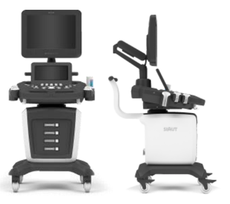
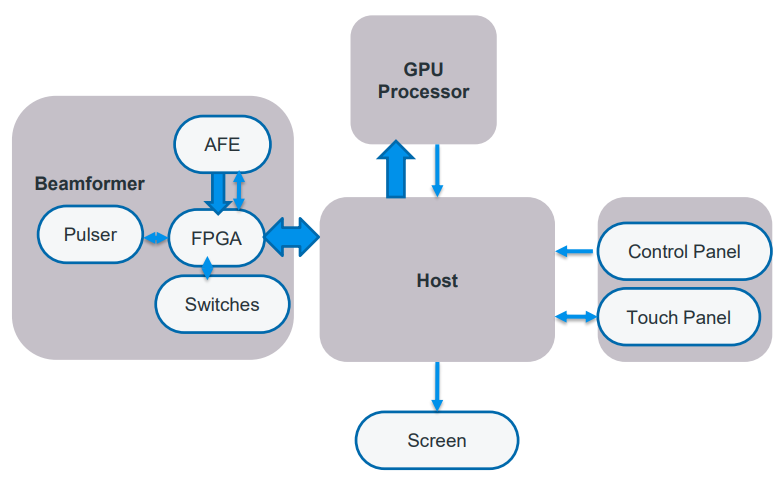
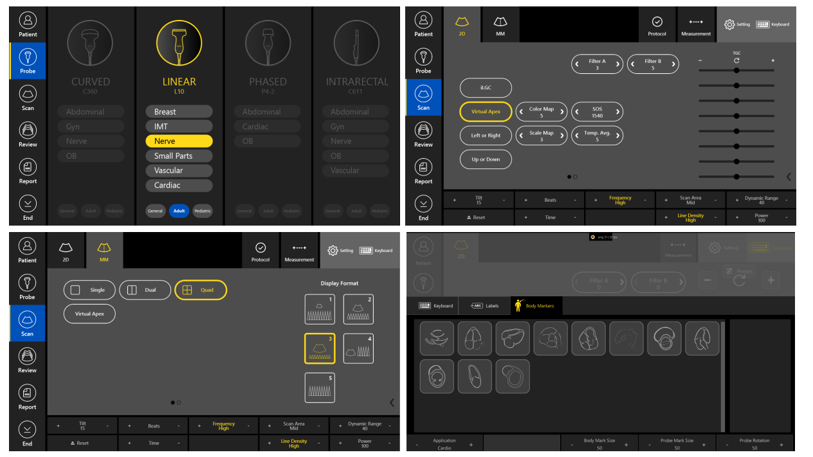
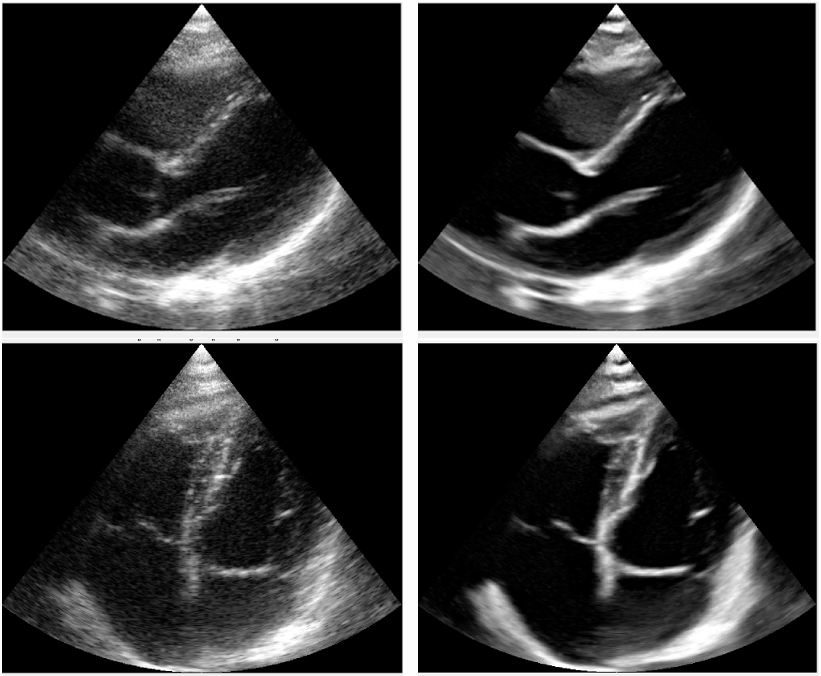
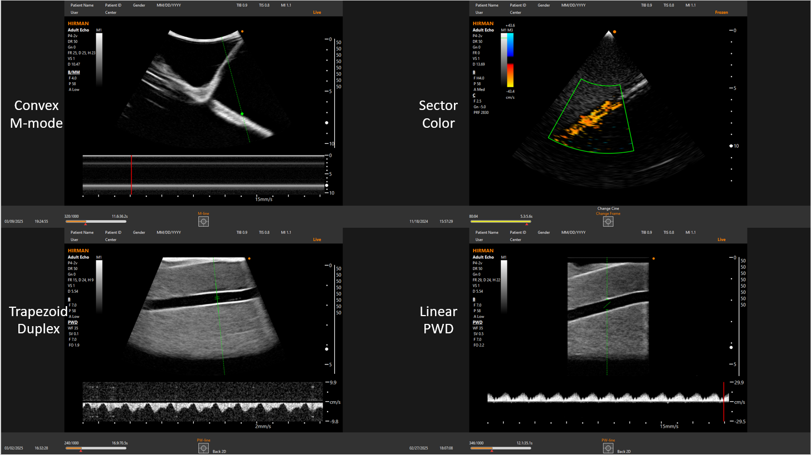
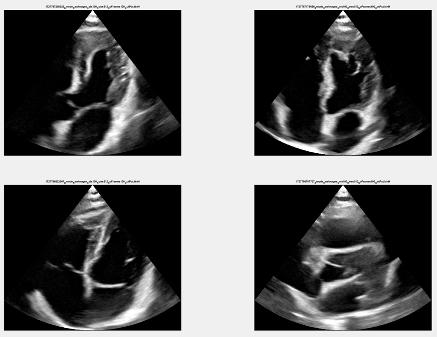
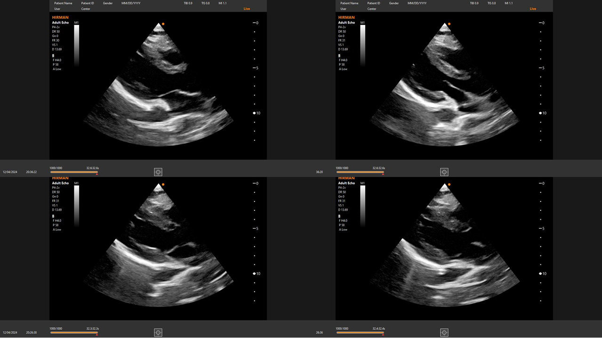
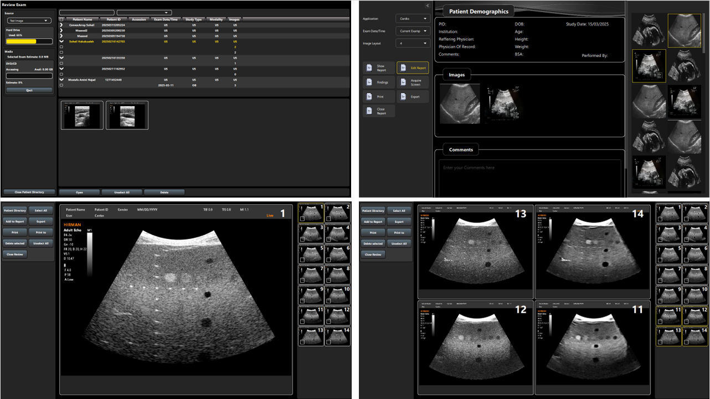

This project encompasses the full-stack design, development, and clinical translation of next-generation clinical ultrasound platforms—ranging from mid-range cart systems (**Luna**, **Zino**) and high-end platforms (**Hirman**) to compact handheld devices.

The architecture bridges custom analog/digital front-end hardware (AFE, FPGA), real-time GPU beamforming pipelines (CUDA/C++), and an intuitive dual-screen clinical user interface (Qt/QML).

---

## 1. Platform Hardware Design

The cart-based platform was designed around a dual-display ergonomic architecture: a high-resolution primary clinical monitor mounted on an articulating arm, and an integrated multi-touch control panel embedded within the physical console. The mobile trolley provides probe holders, peripheral storage, and cable-managed mobility for bedside and examination-room workflows.

*Figure 1: Cart-based clinical ultrasound platform (front and side views): articulating primary monitor, embedded touch control panel, physical console with probe holders, and mobile trolley with cable management.*

### Ergonomic & Industrial Design Highlights
*   **Articulating Monitor Boom:** Multi-axis primary display arm with height/angle adjustment for seated and standing scanning postures.
*   **Integrated Console:** Physical control surface (keypad, rotary knobs, gain sliders) merged with the secondary multi-touch panel for hybrid tactile/digital operation.
*   **Probe Management:** Multi-transducer holders with automatic probe identification and instant preset recall.
*   **Mobile Trolley:** Locking caster wheels, compact footprint, and integrated cable routing for examination-room mobility.

---

## 2. System Architecture & Hardware-Software Pipeline

The platform follows a modular, low-latency architecture optimized for high frame rates, adaptive acoustic beamforming, and responsive clinical control.

*Figure 1: End-to-end hardware and processing architecture linking Front-End Beamformer, FPGA/AFE modules, Host processing unit, GPU compute engine, and clinical I/O consoles.*

### Core Architectural Subsystems
*   **Analog Front-End (AFE) & High-Voltage Pulser/Switches:** Multi-channel transmit/receive circuitry driving diverse probe topologies (Phased/Sector, Linear, Convex, Intrarectal).
*   **FPGA Acquisition Hub:** High-speed serialized RF data capture, digital demodulation, decimation, and PCIe/USB data streaming to the host system.
*   **GPU Compute Pipeline (CUDA / C++):** Real-time software beamforming, analytical signal processing, scan conversion, and dynamic filter execution directly on GPU memory.
*   **Host Subsystem & I/O:** Dual-display driving architecture managing the high-refresh primary clinical monitor, secondary multi-touch screen, and physical control console.

---

## 3. Touch Panel Interface & Clinical Workflow Control

A dedicated secondary touchscreen running an optimized Qt/QML interface provides immediate tactile control over scanning parameters, active transducers, and anatomical markers.

*Figure 2: Touch panel interface layouts: (Top-Left) Transducer selector (Curved, Linear, Phased, Intrarectal); (Top-Right) Active B-mode scan controls and digital TGC sliders; (Bottom-Left) Multi-viewport layout selection (Single, Dual, Quad); (Bottom-Right) Standardized cardiac body marker library.*

*   **Transducer & Application Presets:** Instant switching across probe types with application-specific parameter presets (Cardiac, Vascular, Abdominal, Nerve, Small Parts).
*   **Digital Time Gain Compensation (TGC):** Eight-zone depth-dependent attenuation compensation sliders with instant reset.
*   **Multi-View Configuration:** Dynamic switching between Single, Dual, and Quad viewport layouts for comparative diagnostics.
*   **Anatomical Annotation:** Integrated cardiac and general body markers with real-time probe rotation and angle indicators.

---

## 4. Advanced Beamforming & Real-Time Signal Processing

To achieve high contrast resolution and edge preservation across deep and superficial imaging depths, advanced beamforming schemes were designed, simulated, and deployed in CUDA/C++:

*   **Adaptive Beamformers:**
    *   **Delay-and-Sum (DAS):** Base low-power, high-frame-rate standard beamforming.
    *   **Minimum Variance (MV):** Data-dependent adaptive weight calculation for side-lobe suppression and lateral resolution sharpening.
    *   **Delay-Multiply-and-Sum (DMAS):** Non-linear spatial correlation beamforming for enhanced speckle SNR and cyst contrast.
    *   **Short-Lag Spatial Coherence (SLSC):** Coherence-based imaging minimizing acoustic clutter and reverberation artifacts.
*   **Real-Time Post-Processing & Filtering:**
    *   Dynamic range compression, synthetic aperture compounding, and frequency compounding.
    *   Speckle-reduction filtering, edge-enhancement kernels, and directional tissue smoothing.

*Figure 3: Adult echocardiography cine loops (Parasternal Long-Axis view) acquired on the Hirman platform showing sharp endocardial border delineation and valvular dynamics.*

---

## 5. Comprehensive Imaging Modalities

The system supports multi-probe array geometries and full-spectrum clinical imaging modalities:

*Figure 4: Multi-modality clinical captures: (Top-Left) Convex Anatomical M-mode; (Top-Right) Phased-Array Sector Color Flow Doppler; (Bottom-Left) Trapezoid Duplex; (Bottom-Right) Linear Pulsed Wave Doppler (PWD).*

### Modality Engineering Highlights
*   **M-Mode & Anatomical M-Mode:** High-temporal-resolution line sampling with arbitrary angle steering for accurate chamber dimension and wall thickness measurements.
*   **Color & Power Doppler:** High-frame-rate autocorrelator implementation on CUDA for real-time hemodynamic velocity mapping and low-velocity microvascular detection.
*   **Spectral Doppler (PWD / CWD):** Real-time wall filtering, automated envelope tracing, and spectral audio streaming.
*   **Advanced Phased-Array Modalities:** Real-time speckle tracking, elastography, and ultrafast plane-wave imaging prototypes for research and high-end clinical evaluation.

---

## 6. Clinical Echocardiography Gallery

The phased-array cardiac engine is optimized for high temporal resolution (up to $50+\text{ fps}$), wide dynamic range ($50\text{ dB}$), and penetration up to $15\text{ cm}$ for adult transthoracic echocardiography.

*Figure 5: High-frame-rate transthoracic echocardiography captures across apical 4-chamber, apical 2-chamber, and parasternal orientations.*

*Figure 6: Diagnostic-quality cardiac cycles processed through the CUDA beamforming pipeline with low acoustic clutter in ventricular cavities.*

---

## 7. Review Station, DICOM Archival & Structured Reporting

The software includes a PACS-compliant review station and database management subsystem for seamless hospital workflow integration.

*Figure 7: Clinical study review workflow: (Top-Left) Patient study directory and media management; (Top-Right) Structured clinical report editor; (Bottom) Single-frame and 4-up synchronized cine playback alongside calibration phantom evaluations.*

*   **PACS & DICOM 3.0 Compliance:** Native DICOMDIR parsing, Modality Worklist (MWL) management, Store SCU, and structured export.
*   **Multi-View Cine Review:** Multi-viewport comparison matrix (Single, Dual, Quad layouts) with dynamic zoom, pan, and post-freeze measurement tools.
*   **Structured Reporting:** Automated transfer of biophysical calculations, hemodynamic parameters, and clinician impressions into printable and exportable reports.

---

## 8. Technology Stack Summary

*   **Hardware & Front-End:** Analog Front-End (AFE), High-Voltage Pulsers, T/R Switches, Custom FPGA Acquisition Boards.
*   **Compute & Algorithms:** C++, CUDA, MATLAB (Prototyping), SIMD Optimizations, OpenGL/Vulkan rendering.
*   **Application & UI Framework:** Qt 5/6, QML, C++, Linux (Ubuntu Real-Time Kernel), Android (Handheld platform).
*   **Standards & Protocols:** DICOM 3.0, IHE Radiology/Cardiology profiles, Medical Device Safety & Usability standards.
